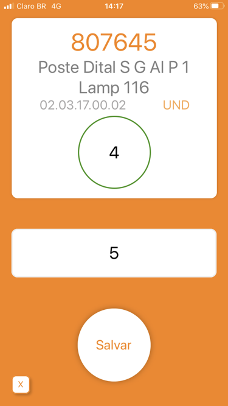

<h1 align="center">
  
   
My Stock</h1>

  
  
  

<h4 align="center">
  App created to perform stock balance maintenance.
</h4>

  <a href="#rocket-technologies">Technologies</a>

## :rocket: Technologies

- [ReactJS](https://reactjs.org/)
- [Expo](https://Expo.io/)
- [Axios](https://github.com/axios/axios)
- [VS Code][vscode] with [EditorConfig][vceditconfig] and [ESLint][vceslint]
